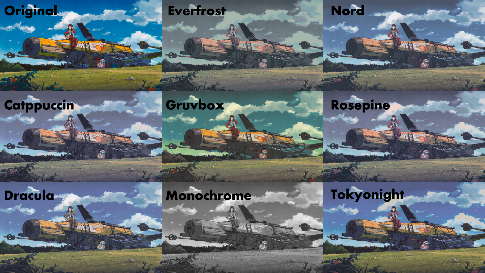

<h1 align="center">Rust-wallz</h1>

<div align="center">

</div>

---

### Usage

```bash
git clone https://github.com/apaul02/rust-wallz
cd rust-wallz
```
- Add your fav color palette.
- Add path to your image.

```bash
cargo run
```
For `ImprovedCiede2000` add this:
```rust
let diff_a: f32 = ImprovedCiede2000::improved_difference(pixel_lab, **color_a);
let diff_b: f32 = ImprovedCiede2000::improved_difference(pixel_lab, **color_b);
```

For `DeltaE` add this:
```rust
let diff_a: f32 = DeltaE::delta_e(pixel_lab, **color_a);
let diff_b: f32 = DeltaE::delta_e(pixel_lab, **color_b);
```
---

### Workflow

1. Upsales the image to 2x.
2. Creates a new blank image.
3. Then iterate over every pixel and check for nearest color in the given palette in LAB format.
4. Apply Jarvis, Judice, and Ninke dithering
5. Then downsample to the original res using Lanczos3

### Few Points

- I am using two methods to calculate nearest pixel.
  - **DeltaE**: Computationally **less expesive**, but produces slightly **worse** result.
  - **ImprovedCiede2000**: Computationally **Very expensive**, produces **best** result result.
- **Dither Strength** : Less means low noise but worse colors, high means best colors high noise.

> [!WARNING]
> **Early Version**
>
> Since there is no multithreading for now, **I DO NOT RECCOMEND USING HIGH-RES IMAGE** with **ImprovedCiede2000**.  <br>

### Acknowledgments

This project has been inspired by the work of others in the open-source community:

- [doprz/dipc](https://github.com/doprz/dipc)
- [ashish0kumar/tint](https://github.com/ashish0kumar/tint)
- [Achno/gowall](https://github.com/Achno/gowall)

---

## Future Work

- Add Multithreading.
- Add support for user input color palette.
- Probably make it a cli tool.